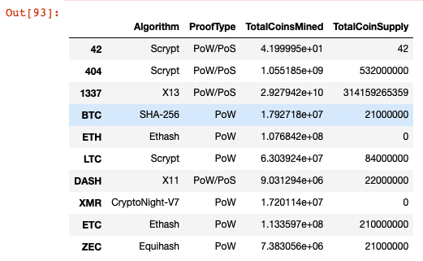
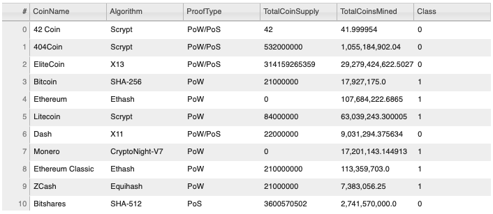

# Cryptocurrencies

## Introduction

This analysis was to assist a client at Accountability Accounting firm, an investment bank, on their offering of a new cryptocurrency investment portfolio to their customers. My job in this is to create a report that includes all of the cryptocurrencies that are trading in the market, and how they could be grouped together to create a classification system for this new investment. 

Unsupervised learning is being used in this task, and to group the cryptocurrencies, a clustering algorithm is being used. Data visualization will be used to share our findings with the board.

The following deliverables are provided:
- Deliverable 1: Pre-processing the Data for PCA
- Deliverable 2: Reducing Data Dimensions using PCA
- Deliverable 3: Clustering Cryptocurrencies Using K-Means
- Deliverable 4: Visualizing Cryptocurrency Results

## Deliverable Results

### Deliverable 1: Pre-processing the Data for PCA
- The following is a final dataframe snapshot of all the cryptocurrencies being traded and mined:
  - 

- Get dummies was then utilized for the purpose of creating variables for text features:
  - 

- Finally, the data was standardized with StandardScaler():
 - 

### Deliverable 2: Reducing Data Dimensions Using PCA
- In this deliverable, the Principal Component Analysis (PCA) algorithm has first been been applied to reduce the dimensions of the data to only three principal components using fit_transform: 
  - 

- Next, these components were and then placed into its own new DataFrame, as shown below:
  - 

### Deliverable 3: Clustering Cryptocurrencies Using K-means
To complete this deliverable, the K-algorithm was applied in order to cluster the cryptocurencies using the PCA data using the following steps:
- Creating an elbow curve to identify the best K-value
  - 

- Making predictions on the cryptocurrency K-clusters
  - 
- Lastly, producing a new DataFrame with the same index as crypto_df, but has the columns:
  - Algorithm
  - ProofType
  - TotalCoinsMined
  - TotalCoinSupply
  - PC 1
  - PC 2
  - PC 3
  - CoinName
  - Class
    - 

### Deliverable 4: Visualizing Cryptocurrencies Results
- A 3D scatter plot was created to plot the three clusters appropriate CoinName, Algorithm, hover_name and hover_data parameters upon hovering  data in the graph
  - 

- Created another table of tradable currencies using the function hvplot.table()
  - 

- Printed the total number of tradable currencies
  - 

- Created another new DataFrame using the clustered_df index, and then adding the CoinName and Class to the new DataFrame
  - 

- Created an hvplot where x = "TotalCoinsMined" and y = "TotalCoinSupply", and the data is organized on the graph by "Class". The information, such as the "CoinName" should display upon hovering over the data points.
  - 

## Conclusion

In conclusion, based on all the images provided, it has been demonstrated that the classification of the new cryptocurrency portfoliio was indeed a success.

